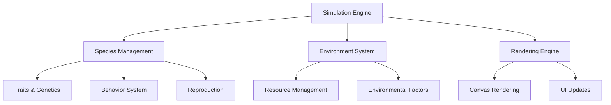

# EcoForge - Ecosystem Simulation

A comprehensive, interactive ecosystem simulation that models complex biological systems, species interactions, and evolutionary dynamics in real-time.


## 🌿 Overview

EcoForge is a browser-based ecosystem simulation that demonstrates fundamental ecological principles through an interactive visual environment. Watch as species evolve, compete for resources, form complex food webs, and adapt to changing environmental conditions.

## ✨ Key Features

### 🔬 Species Traits & Behaviors
- **Three Organism Types**: Producers (plants), Herbivores, and Carnivores
- **Unique Traits**: Size, speed, vision range, reproduction rates, and energy requirements
- **Adaptive Behaviors**: Foraging, predation, reproduction, and environmental response
- **Lifecycle Management**: Birth, growth, reproduction, and death based on energy and age

### 🕸️ Food Web Relationships
- **Trophic Levels**: Complete food chain from producers to top predators
- **Predator-Prey Dynamics**: Realistic hunting and consumption behaviors
- **Energy Transfer**: Efficient energy flow between trophic levels
- **Competition**: Intra-species and inter-species resource competition

### 📊 Population Dynamics
- **Real-time Monitoring**: Live population counts and species diversity
- **Carrying Capacity**: Environmental limits on population growth
- **Boom-Bust Cycles**: Natural population fluctuations based on resource availability
- **Extinction Events**: Species disappearance and ecosystem reorganization

### 🔄 Evolutionary Mechanisms
- **Genetic Mutation**: Random trait variations in offspring
- **Natural Selection**: Survival of the fittest through environmental pressures
- **Adaptive Radiation**: Species diversification to fill ecological niches
- **Coevolution**: Reciprocal evolutionary changes between interacting species

### 🌍 Environmental Systems
- **Dynamic Conditions**: Fluctuating temperature and resource availability
- **Resource Management**: Renewable and limited resource pools
- **Environmental Stress**: Impact of changing conditions on species survival
- **Habitat Constraints**: Spatial boundaries and carrying capacity

## 🚀 Getting Started

### Prerequisites
- Modern web browser with HTML5 and JavaScript support
- No additional installations required

### Installation
1. Download the `ecoforge.html` file
2. Open it in your preferred web browser
3. The simulation will load automatically

### Quick Start
1. Click **"Start Simulation"** to begin
2. Observe initial species interactions
3. Use controls to adjust simulation parameters
4. Add new species with **"Add New Species"** button
5. Monitor statistics in real-time

## 🎮 User Interface

### Simulation Controls
- **Start/Pause**: Toggle simulation running state
- **Reset**: Restart simulation with initial conditions
- **Add New Species**: Introduce new herbivore or carnivore species

### Parameter Adjustments
- **Simulation Speed**: Control time progression (1x to 10x)
- **Mutation Rate**: Adjust genetic variation probability (1% to 100%)
- **Resource Abundance**: Set plant growth rate (1% to 100%)

### Monitoring Panels
- **Population Statistics**: Total organisms, species count, generation number
- **Active Species**: Real-time species list with visual identifiers
- **Environment Factors**: Temperature and resource availability indicators
- **Food Web Legend**: Color-coded species type identification

## 🔧 Technical Implementation

### Architecture


### Core Classes

#### Species Class
```javascript
class Species {
    constructor(id, type, color, x, y) {
        this.id = id;
        this.type = type;        // 'producer', 'herbivore', 'carnivore'
        this.color = color;      // Visual representation
        this.x = x;              // Position
        this.y = y;
        this.size = 4-6;         // Physical size
        this.speed = 0.5-2;      // Movement capability
        this.energy = 100;       // Life energy
        this.age = 0;            // Lifespan tracking
        this.vision = 0-80;      // Detection range
        this.reproductionRate = 0.01-0.02;
        this.diet = type-based;  // Feeding preferences
    }
}
```

#### Plant Class (Producers)
```javascript
class Plant {
    constructor() {
        this.x = randomPosition();
        this.y = randomPosition();
        this.size = 3-6;
        this.color = '#4cd964';
        this.energy = 50;
    }
}
```

### Simulation Loop
1. **Environment Update**: Adjust temperature and resources
2. **Plant Growth**: Add new plants based on resource abundance
3. **Species Update**: 
   - Movement and behavior
   - Feeding and energy consumption
   - Reproduction with mutation
   - Death from old age or energy depletion
4. **Rendering**: Draw all organisms and environment
5. **Statistics Update**: Refresh UI with current data

## 🔬 Scientific Foundations

### Ecological Principles Modeled

#### Population Ecology
- **Exponential Growth**: Unlimited resource scenarios
- **Logistic Growth**: Resource-limited population curves
- **Carrying Capacity**: Environmental limits on populations
- **Competitive Exclusion**: Species competing for identical resources

#### Evolutionary Biology
- **Natural Selection**: Differential survival and reproduction
- **Genetic Drift**: Random changes in trait frequencies
- **Adaptation**: Traits improving survival and reproduction
- **Speciation**: Emergence of new species characteristics

#### Ecosystem Dynamics
- **Energy Flow**: Unidirectional energy transfer through trophic levels
- **Nutrient Cycling**: Decomposition and resource renewal
- **Succession**: Ecological community development over time
- **Stability and Resilience**: Ecosystem response to disturbances

### Mathematical Models

#### Population Growth
```
dN/dt = rN(1 - N/K)
Where:
N = Population size
r = Intrinsic growth rate
K = Carrying capacity
```

#### Lotka-Volterra Predator-Prey
```
Prey: dx/dt = αx - βxy
Predator: dy/dt = δxy - γy
Where:
x = Prey population
y = Predator population
α, β, δ, γ = Interaction parameters
```

## 📈 Analysis Tools

### Data Collection
- Real-time population tracking
- Species diversity metrics
- Generation counting
- Mutation event logging

### Visualization
- Color-coded species identification
- Movement trails (optional)
- Population trend graphs
- Food web relationship mapping

## 🎯 Educational Applications

### Classroom Demonstrations
- **Biology**: Evolution, ecology, and population dynamics
- **Environmental Science**: Ecosystem management and sustainability
- **Mathematics**: Modeling biological systems with equations
- **Computer Science**: Algorithm development and simulation design

### Learning Objectives
1. Understand trophic levels and energy transfer
2. Observe natural selection in action
3. Analyze population growth models
4. Explore genetic variation and adaptation
5. Study ecosystem stability and resilience

## 🔍 Experimental Scenarios

### Sample Investigations

#### 1. Predator-Prey Dynamics
- Start with balanced herbivore and carnivore populations
- Observe cyclical population fluctuations
- Analyze impact of initial population ratios

#### 2. Environmental Stress
- Rapidly decrease resource abundance
- Monitor species adaptation and extinction
- Study ecosystem recovery mechanisms

#### 3. Genetic Diversity
- Set high mutation rates
- Track emergence of new traits
- Analyze survival advantages of specific adaptations

#### 4. Invasion Biology
- Introduce new species mid-simulation
- Observe competitive interactions
- Study ecosystem resistance to invaders

## 🛠️ Customization Options

### Modifiable Parameters
- Initial population sizes
- Trait value ranges
- Environmental fluctuation rates
- Mutation characteristics
- Resource distribution patterns

### Extension Possibilities
- Additional species types (omnivores, decomposers)
- Complex environmental factors (seasons, disasters)
- Spatial heterogeneity (different habitat zones)
- Cooperative behaviors (symbiosis, pack hunting)

## 📊 Performance Considerations

### Optimization Features
- Efficient collision detection algorithms
- Population capping mechanisms
- Adaptive rendering based on population density
- Memory management through object pooling

### System Requirements
- Modern JavaScript-enabled browser
- Recommended: 2GB RAM for large simulations
- Optimal performance with hardware acceleration

## 🐛 Known Limitations

### Current Constraints
- 2D spatial representation
- Simplified genetic system
- Basic environmental factors
- Limited species interactions

### Planned Enhancements
- 3D visualization options
- Complex genetic inheritance
- Advanced environmental modeling
- Expanded behavioral repertoire

## 🤝 Contributing

We welcome contributions from educators, students, and developers:

1. Fork the repository
2. Create feature branches
3. Submit pull requests with clear descriptions
4. Follow established code style guidelines

### Areas for Contribution
- Additional species behaviors
- Enhanced visualization options
- Educational lesson plans
- Performance optimizations
- Documentation improvements

## 📚 References & Further Reading

### Ecological Theory
- Odum, E.P. - "Fundamentals of Ecology"
- Begon, M. et al. - "Ecology: From Individuals to Ecosystems"
- Ricklefs, R.E. - "The Economy of Nature"

### Evolutionary Biology
- Darwin, C. - "On the Origin of Species"
- Futuyma, D.J. - "Evolutionary Biology"
- Coyne, J.A. - "Why Evolution is True"

### Computational Biology
- Grimm, V. & Railsback, S.F. - "Individual-Based Modeling and Ecology"
- DeAngelis, D.L. & Gross, L.J. - "Individual-Based Models and Approaches in Ecology"

## 📄 License

This project is licensed under the MIT License - see the LICENSE file for details.

## 🙏 Acknowledgments

- Inspired by classic ecosystem simulations like NetLogo and Biosphere
- Educational input from ecology and biology educators
- Testing and feedback from student users
- Open source community contributions

---

**EcoForge** - *Exploring the complex beauty of ecological systems through interactive simulation*

For questions, suggestions, or collaboration opportunities, please open an issue or contact the development team.
